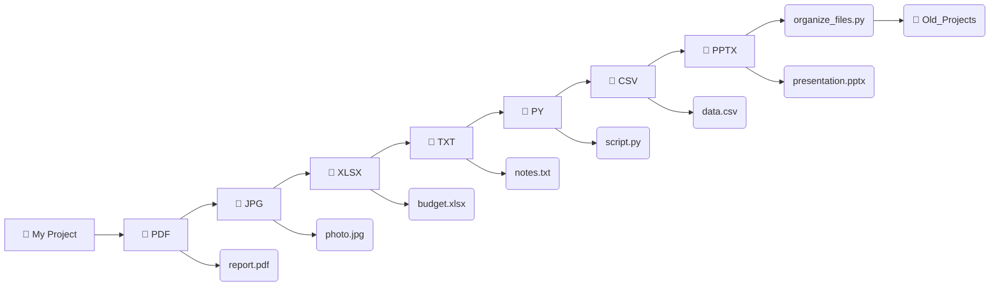

File Organizer – A tiny Python script that automatically sorts files in your current directory into subfolders based on their extensions. Keeps your workspace clean, avoids touching directories, and never moves itself. Perfect for quick cleanup!

# 📁 File Organizer

[](https://www.python.org/downloads/)
[](https://opensource.org/licenses/MIT)
[](http://makeapullrequest.com)

A lightweight, no‑frills Python script that **automatically sorts files** in your current directory into dedicated folders based on their file extensions (e.g., `.pdf` → `pdf/`, `.txt` → `txt/`).  
It’s safe, fast, and respects your folders – it never touches subdirectories and even protects itself from being moved!

## ✨ Features

- 📂 **Groups files by extension** – all `.pdf` go to `pdf/`, all `.jpg` to `jpg/`, etc.
- 🛡️ **Ignores directories** – leaves your folder structure intact.
- 🧠 **Self‑aware** – skips the script itself (so you don’t lose it).
- ⚠️ **No overwrites** – renames duplicate files (e.g., `file_1.pdf`) to avoid data loss.
- 🚀 **One‑liner to run** – just `python organize_files.py` and watch the magic.

## 🔧 Installation

1. **Clone the repository** (or just download the script):
   ```bash
   git clone https://github.com/yourusername/file-organizer.git
   cd file-organizer
Make sure you have Python 3.6+ installed.

(Optional) Create a virtual environment – not required, as the script uses only the standard library.

🚀 Usage
Navigate to the directory you want to clean up and run:

bash
python organize_files.py
That’s it! All files (except the script itself and subfolders) will be sorted into extension‑named folders.

## 🖼️ Real-World Example

Here is a visual breakdown of exactly what happens when you run the script in a messy directory.

## 🖼️ Real-World Example

Here is a visual breakdown of exactly what happens when you run the script in a messy directory.

**Before (Chaos - files in a messy row):**
## 🖼️ Real-World Example


**After (Clean & organized):**


simple Example
Before:

text
Documents/
├── report.pdf
├── photo.jpg
├── notes.txt
├── another.pdf
└── organize_files.py   (the script)
After running:

text
Documents/
├── pdf/
│   ├── report.pdf
│   └── another.pdf
├── jpg/
│   └── photo.jpg
├── txt/
│   └── notes.txt
└── organize_files.py   (still here)
🛠️ How It Works
The script:

Scans all items in the current working directory.

Skips any subdirectories and itself.

For each file with an extension, it creates a folder named after that extension (without the dot) if it doesn’t already exist.

Moves the file into that folder. If a file with the same name already exists, it appends _1, _2, etc., to avoid overwriting.

All logic is contained in a single, readable Python file – no external dependencies.

⚙️ Customisation
You can easily adjust the behaviour:

Ignore additional files – add them to the skip condition in the script:

python
if item in ["README.md", "temp.log", ...]:
    continue
Change the target directory – replace os.getcwd() with your own path.

Handle extension‑less files – modify the if not ext: block to move them to a misc/ folder instead of skipping.

🤝 Contributing
Contributions, issues, and feature requests are welcome!
Feel free to check the issues page or open a pull request.

Fork the project.

Create your feature branch (git checkout -b feature/AmazingFeature).

Commit your changes (git commit -m 'Add some AmazingFeature').

Push to the branch (git push origin feature/AmazingFeature).

Open a pull request.

📄 License
Distributed under the MIT License. See LICENSE for more information.

Enjoy a cleaner workspace! ⭐ If this script saves you time, give it a star on GitHub – it helps others find it too!

